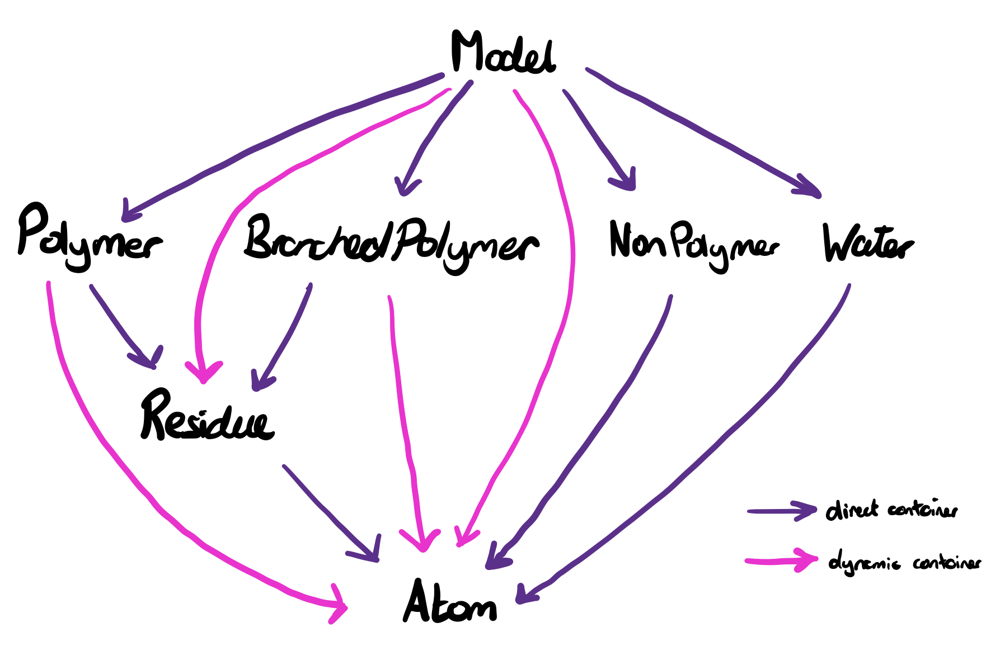

# Techical Specification

atomium is a Python library for parsing 3D molecular structures, analysing their contents, and saving those structures back to various file formats.

This document describes how atomium works at a conceptual level, and the main subdivisions of its functionality. It is not necessary to read in order to use atomium (though it may be enlightening). It is probably necessary to read for a developer who wants to work on the atomium codebase.

## Parsing mmCIF to Files

The core functionality of atomium is parsing mmCIF files into Python objects with meaningful, fully queryable contents. Everything else is largely an extension of or wrapper around this functionality.

### Obtaining mmCIF filestrings

The `io.py` module contains the functions for obtaining filestrings. These filestrings can be obtained either by opening a local file, fetching a remote file using the HTTP protocol, or fetching a remote file using the SSH protocol:

- Local files are opened using the `open` function, which can handle gzipped files and binary files too.
- Remote files are accessed over HTTP using `fetch`, which can take either a URL, or a PDB code, in which case the relevant hardcoded service URL is used.
- Remote files are accessed over SSH using `fetch_over_ssh`, which require a hostname, username, remote path and password.

All of these functions end by calling `parse_filestring` on whatever string/bytestring object is produced. This function works out what filetype the string represents, and calls the appropriate function for turning that filestring into a mmCIF dictionary. In the case of mmCIF, this `mmcif_string_to_mmcif_dict`.

### mmCIF Parsing

The `mmcif.py` module contains most of the logic for parsing mmCIF file strings. mmCIF files are essentially sequential data tables, and the main `mmcif_string_to_mmcif_dict` creates a dictionary representation of these tables, where each table is a list of row dictionaries.

This is a straightforward process, with the only complications arising from the need to handle nested quotes, and the tendency of some rows to be broken over multiple lines.

### `File` creation

Turning a filestring into an mmCIF dictionary is one of the two steps in parsing. The other is creating a `File` object from that dictionary. The `File` object (found in `file.py`) takes this dictionary as its `__init__` argument, and stores a reference to it as `source`. It also has a name property, which it tries to extract from the mmCIF dictionary.

These two attributes, along with `models` (see below), are the only three direct properties of the `File` object. It does have a few dynamic properties such as `title`, `classification` etc. which try to extract said information from the mmCIF dictionary when you access them. In addition, `__getattr__` is overridden, which lets you access any key or subkey of the mmCIF dictionary like a property.

The third attribute, `models`, is a list of `Model` objects. In atomium, models are made up of discrete molecules, which are accessed using `molecules()`. Each of these molecules is an instance of some entity, which is essentially a molecule type. These entities are dynamic classes, generated from the list of entities in the mmCIF dictionary. These entities are subclasses of either `Polymer`, `BranchedPolymer`, `NonPolymer` or `Water`, which are in turn subclasses of the base `Entity` class.

For example, suppose a model has some polymer chains, some water molecules, two glucose molecules, and two glycerol molecules. Each of those glucose molecules would be an instance of the Glucose class that was dynamically created during parsing, which is a subclass of the `NonPolymer` class, which is a subclass of the `Entity` class.

 These four types of entity have different properties:

- polymers are made up of `Residue` objects, which are stored in sequence. They have associated sequences and secondary structure.
- Branched-polymers are made up of `Residue` objects, but not stored in any particular order.
- Non-polymers are direct containers of `Atom` objects.
- Waters are functionally equivalent to non-polymers in atomium.

The last two are direct containers of atoms, while the first two are direct containers of residues, which are themselves direct containers of atoms. All entity objects have an `id`, and an `auth_id`.

During `File` creation, the models are created by the `create_models` function. This function does the heavy lifting of creating structures from the mmCIF dictionary. This function:

- Creates custom entity classes for all the entities in the mmCIF file. The polymer entities will have sequences annotated to them.
- Creates dictionaries of secondary structure labels supplied by the mmCIF.
- Creates a dictionary of anisotropy information.
- Divides the atoms listed in the mmCIF dictionary into different models (often there's just one model), and for each:
  - divides the atoms into molecules.
  - creates a molecule from those atoms, using the custom entity classes and secondary structure dictionaries.
  - Creates a `Model` object as a container for these molecules.

### Querying

Structures in atomium are arranged in a hierarchy. One model has multiple molecules, multiple polymers, multple waters etc. One polymer has multiple residues, which each have multiple atoms. All of these one-to-many relationships have a one-to-one reverse relationship (an atom has one parent residue, a residue has one parent polymer, etc.).

These groups of child objects are not stored as tuples, lists or sets, but as a custom atomium object called a `StructureSet`. This behaves much like a set, in that it is an unordered collection of objects, but internally they are dictionaries where they key is object ID, and the value is a set of objects with that ID. This allows for rapid lookup by ID.

These structure sets are stored as private attributes, with a method of the same name which returns them. That is, a residue will have an `_atoms` attribute and a `atoms()` method which returns it.

All the structure classes utilise the `StructureClass` metaclass, which overrides certain aspects of instantiation. Specifically, it takes all the methods referred to above (`atoms()`, `residues()` etc.) and applies a decorator to them that allows them to take query arguments. It also creates a second singular method (`atom()`) for returning a single value.

This query language is very flexible. It allows the returned objects to be queryied by any property, by the regex of any string property, by the comparitor of any numeric property, and by properties of properties using underscores - such as `atoms(element="N", residue__name="HIS")`.

## Properties

In addition to direct attributes, atomium objects have various dynamic, calculated properties.

Some of these are specific to particular classes. For example, atoms have various properties that use their element to give their mass, and residues have properties for pointing to the next residue if they are in a polymer.

All of the classes which are in some way a container of atoms subclass the `AtomStructure` class, which provides many more generic properties, such as overall mass, center of mass, radius of gyration etc.

## Structure Comparisons

Atoms and structures have various methods for comparing themselves to other atoms and structures.

Mostly these are related to distance. Atoms can get their distance to other atoms (as well as their angle with two other atoms), and have methods for determining the atoms within some radius (filterable by the atomium query language) and the residues or molecules within some radius. Structures themsevles have `nearby_atoms`, `nearby_residues` and `nearby_molecules` that essentially wrap around the equivalent methods of their atoms.

Distance lookup can be quite computationally expensive as it often involves pairwise comparisons, and the combinatorics of this can get very large. There are two optimisations used:

1. Models have a `optimise_distances` method which, when called, puts all atoms in a grid. Calls to the `atoms_in_sphere` method that underpins all the `nearby_` method calls will first use this gird to get only atoms which could feasibly be nearby, and only do the Pythagorean measurement on that subset of atoms.

2. The `atoms_in_sphere` method doesn't go through each atom one by one and call its `distance_to` method on the sphere centre. It uses the scipy `cdist` method to do it all in one big matrix calculation.

The other comparison methods relate to RMSD, a measure of similar two structure's coordinates are. This involves creating a mapping of each atom in one structure to its corresponding atom in the other. Names, elements, atomium IDs, and Python IDs are used to order them correctly - this last one being used to ensure that unmatchable structures are at least ordered the same way each time.

## Structure Modification

Some methods modify the contents of a model, structure or atom. Where these methods render the `_internal_grid` created by `_optimise_distances` out of date, they have a decorator applied which deletes the grid.

All structures have a `remove()` method which lets them remove one of their contents. They can remove their direct children (atoms from residues, residues from polymers etc.) or indirect children, in which case the thing being removed will be removed from its direct parent.

All structures also have a `copy()` method, which creates an identical structure with no parent.

Structures can also be removed - translated with a vector, rotated with a rotation matrix, or rotated around an axis. In the latter case, a rotation matrix will be calculated on the fly.

## Biological Assemblies

PDBs contain instructions for generating alternate versions (biological assemblies) of the main model (asymmetric unit). Each assembly has 1 or more steps, each of which has a list of molecules and a list of operations. For each operation (a matrix and vector), the molecules in the list are copied, rotated with the matrix, and translated with the vector.

The list of operation IDs have a complicated structure - if just a list, they refer to operation objects defined in the file. If multiple bracket enclosed lists, the operations are generated by matrix multiplying all the operations in one list by all the ones in the other.

## BinaryCif Interchange

BinaryCif is a file format for storing a complete mmCIF file in a compressed form.

To uncompress it, the bytstring is opened with `msgpack`, to get a dictionary which is essentially a list of category objects, each of which is a list of column objects. Each column has some binary data, and a list of encodings that have been applied to it which should be undone in reverse order. There are seven kinds of encoding.

Columns can also have a 'mask' associated, which specifies what symbol should be used for empty values - `?` or `.`.

Turning the list of columns into an mmCIF dictionary is then a very straightforward process. Some line breaks need to be removed from certain strings, and everything should be converted to a string to make it identical the those created from mmCIF.

## MMTF Interchange

MMTF is another file format for storing mmCIF data in a compressed form - though in this case it is just a subset of the data.

The binary contents are extracted using `msgpack` to get a dictionary with some bytes data, which must be extracted using custom MMTF algorithms. The end result is an MMTF dictionary, with keys for various important header attributes, and atom information.

An mmCIF dictionary is created from this by manually creating the relevant header tables, and then creating the entities and atom records. Individual atom properties are stored as vectors (the `x` vector, the `occupancy` vector etc.) and properties common to a residue are stored in once in `groups` lists. MMTF also refers to all entity molecules as 'chains'.

## PDB Interchange

## Saving

## Command Line Interface

## Tests